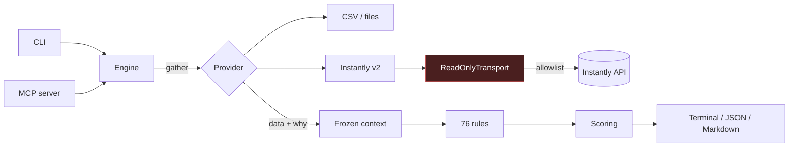

# Campaign Preflight

**Campaign Preflight is a read-only linter for outbound campaigns. It catches
configuration, contact-data, personalization, suppression, schedule, and sender
problems before launch.**

[](https://github.com/katekruger/campaign-preflight/actions/workflows/ci.yml)
[](https://github.com/katekruger/campaign-preflight/actions/workflows/security.yml)
[](https://www.python.org/downloads/)
[](pyproject.toml)
[](LICENSE)

---

## What it does

Every outbound team has shipped a campaign with a mistake in it. Someone who
unsubscribed got emailed anyway. A sequence kept following up after the prospect
replied. A merge field never merged and two hundred people got "Hi
{{first_name}}."

You find out after it sends.

Campaign Preflight runs 76 deterministic checks over a campaign's configuration,
leads, copy, schedule, senders, and suppression exposure, and returns a
readiness decision with evidence for every finding. It never writes to your
provider and it cannot activate anything.

**What it does not do**, up front rather than buried:

- **It does not guarantee deliverability.** It checks configuration and data,
  not inbox placement, and never invents a deliverability score.
- **It does not give legal advice.** Region, domain, and opt-out checks compare
  a campaign against *your own configured policy* — not GDPR, CAN-SPAM, or CASL.
- **It does not verify mailboxes.** Address checks are syntax only. No DNS, no
  SMTP.
- **It does not replace your provider's safeguards.** Keep those on.
- **Results are a point-in-time snapshot.** A campaign that passed at 09:00 can
  be edited at 09:05.

Fuller detail in [docs/limitations.md](docs/limitations.md).

---

## "We checked and it's fine" ≠ "we couldn't check"

A checker that cannot tell those apart is worse than no checker, because it
turns a permissions error into a green light.

Campaign Preflight makes the distinction structural. Every provider read returns
data *plus the reason it does or does not exist*, and every rule declares the
data it needs. If that data is unavailable, the engine short-circuits the rule
to `UNKNOWN` before it can run. Rules cannot opt out.

| Situation | Result |
|---|---|
| Suppression list read, nobody matched | `PASS` |
| No suppression list supplied | `UNKNOWN` → run is `INCOMPLETE` |
| Suppression endpoint returned 403 | `UNKNOWN` → run is `INCOMPLETE` |
| Zero leads in the campaign | `FAIL` |
| Lead endpoint unreachable | `UNKNOWN` |

There are four verdicts, not two: `READY`, `READY_WITH_WARNINGS`, `NOT_READY`,
and `INCOMPLETE`.

---

## Requirements

**Python 3.9 or newer.** That is the whole list.

The package has **no runtime dependencies** — it imports nothing outside the
standard library. `httpx` is an optional extra needed only for the live
Instantly provider, behind a lazy import.

The 3.9 floor is deliberate, and deliberately lower than you might expect. It is
the oldest interpreter the plugin can encounter on a user's machine, and since
there are no dependencies, nothing forces it higher. CI runs 3.9 through 3.13
plus a bare-interpreter job that installs nothing at all, on Linux, macOS, and
Windows.

That combination is what lets the plugin run with no install step: it uses
whatever `python3` is already there.

---

## Install

### As a Claude plugin (marketplace)

```
/plugin marketplace add katekruger/campaign-preflight
/plugin install campaign-preflight
```

The repository is its own marketplace: `.claude-plugin/marketplace.json` sits at
the root alongside the plugin manifest.

### As a Claude plugin (local checkout)

```bash
git clone https://github.com/katekruger/campaign-preflight
```

```
/plugin marketplace add ./campaign-preflight
/plugin install campaign-preflight
```

### As a CLI

```bash
pipx install campaign-preflight
```

Or straight from a checkout, with nothing installed at all:

```bash
PYTHONPATH=src python3 -m campaign_preflight.cli demo
```

### As an MCP server

```bash
claude mcp add campaign-preflight -- campaign-preflight-mcp
```

Six read-only tools. Nothing that could activate, edit, import, or send. Setup
for Claude Code and Claude Desktop: [docs/mcp.md](docs/mcp.md).

---

## Quick start

```bash
campaign-preflight demo
```

No API key. No network. No configuration.

```
CAMPAIGN PREFLIGHT
Campaign: Enterprise Q3 Outbound
Provider: demo
Readiness: NOT READY
Score: 0/100
Confidence: MEDIUM

BLOCKERS

[campaign.stop_on_reply]
Stop-on-reply is disabled: repliers will keep receiving follow-ups.
  Remediation: Enable stop-on-reply on the campaign.

[personalization.prompt_injection]
1 contact(s) have prompt-injection text in their personalization.
  Affected: s***********a@caldera.example.com
  Remediation: Remove the affected personalization and review the enrichment source it came from.

[suppression.contact_listed]
1 contact(s) appear on the active suppression list.
  Affected: m**********s@stonebridge.example.com
  Remediation: Remove these contacts from the campaign before activation.

WARNINGS

[contacts.missing_first_name]
2 of 20 contacts (10.0%) are missing a first name.
  Affected: i**o@summitforge.example.com, r******s@clearwater.example.com
  Remediation: Backfill the missing first names, or use a fallback in your copy.

UNKNOWN

[senders.aggregate_capacity]
Sender capacity is unavailable: 1 of 3 senders report no daily limit.
  Affected: r***n@example.com

------------------------------------------------------------------------------
Summary:
8 blockers, 17 failures, 21 warnings, 1 unknown, 32 passed
20 leads and 3 sender(s) checked in 0.0s
Confidence is MEDIUM: 1 check(s) could not run.
Point-in-time snapshot. Campaign state may change after this check ran.
```

Note the last finding. One sender reports no daily limit, so total capacity
cannot be summed. Most tools would add up the senders that *do* report one and
call it a number. This one says it does not know — and drops confidence from
`HIGH` to `MEDIUM` because of it.

That distinction is the whole idea.

### Checking your own campaign

Once the plugin is installed, describe it in plain language:

> Check this campaign before I send it.

> Here's my lead list — anything wrong with it?  *(paste or upload)*

> I'm sending a 3-email sequence to 200 people, 80 a day, weekdays 9-5 Eastern.
> Is that okay?

There are three ways in, and none needs an account:

| You have | What happens |
|---|---|
| **A file** (uploaded, or on disk) | Checked directly. |
| **A pasted list or some copy** | Written to a scratch file, checked, then cleaned up. |
| **Only a description** | The campaign file is built from what you say, shown to you, then checked. |

Anything you do not know is left blank rather than guessed — a blank field comes
back as "couldn't check", which is the honest answer.

### From files, on the command line

```bash
campaign-preflight check \
  --campaign examples/clean_campaign/campaign.yaml \
  --leads examples/clean_campaign/leads.csv \
  --suppressions examples/clean_campaign/suppressions.csv
```

Three worked examples ship with the repo, one per verdict:

| Example | Verdict | Exit |
|---|---|---|
| [`examples/clean_campaign`](examples/clean_campaign) | `READY`, 100/100 | `0` |
| [`examples/risky_campaign`](examples/risky_campaign) | `NOT_READY`, 13 blockers | `2` |
| [`examples/incomplete_campaign`](examples/incomplete_campaign) | `INCOMPLETE` — nothing is wrong, it just can't be verified | `3` |

### In CI

```bash
campaign-preflight check --campaign campaign.yaml --leads leads.csv --fail-on blocker
```

Exit codes carry the verdict, so this drops straight into a pipeline. See
[docs/ci.md](docs/ci.md).

---

## What is inside

The repository root **is** the plugin. There is no second copy of the tree.

```
.claude-plugin/     plugin manifest and marketplace manifest
skills/             the three skills, one directory each
bin/                launchers the MCP server and CLI run through
src/                the Python package: rules, engine, providers, reporters
tests/              unit, integration, contract
docs/               rules catalogue, configuration, MCP, CI, limitations, architecture
examples/           three worked campaigns, one per verdict
scripts/            generators and the plugin packager
```

---

## Skills

| Skill | Use it for |
|---|---|
| **`preflight-campaign`** | Checking a real campaign you supply — a file, a paste, or a description. |
| **`preflight-demo`** | Watching the checker run against bundled sample data. |
| **`preflight-rules`** | Which rules exist, what each one tests, and how to retune or disable them. |

The boundaries are deliberate: each description names its own situation and
points at its neighbour, so a near-miss lands somewhere recoverable.

---

## What it checks

76 rules across seven categories. Full catalogue: [docs/rules.md](docs/rules.md).

| Category | Rules | Examples |
|---|---|---|
| **Campaign** | 10 | Stop-on-reply disabled, daily volume above threshold, no sending window, dates that leave no sending days |
| **Contacts** | 15 | Malformed addresses, duplicates (exact and case-folded), role inboxes, placeholder values, control and bidi characters, spreadsheet formula injection |
| **Suppression** | 8 | Contacts and domains on your suppression list, existing customers, internal addresses, competitors, restricted regions — and whether the suppression check could run at all |
| **Personalization** | 13 | Unrendered merge tokens, a greeting addressed to the wrong person, a company that isn't theirs, claims unsupported by their own evidence, stale research, **prompt-injection text scraped in from a target's page** |
| **Copy** | 13 | Empty subject on the first step, broken links, `TODO` markers, missing opt-out language, a follow-up identical to the first email |
| **Schedule** | 9 | Invalid timezone, weekend sending, zero active days, a window that ends before it starts, DST transitions inside the campaign |
| **Senders** | 8 | Mailboxes below your health threshold, error states, volume exceeding capacity — and honest `UNKNOWN`s when the provider won't say |

Ask the tool about any of them:

```bash
campaign-preflight rules list --category suppression
campaign-preflight rules explain senders.aggregate_capacity
```

### What it deliberately does not check

There is no spam-word rule. "Free" and "act now" are not evidence of anything,
and shipping that list would train you to ignore the tool. Rules that *are*
judgement calls — copy length, link count, generation artifacts — are marked
`heuristic`, labelled as such in every report, and are never blockers by default.

---

## Configuration

Campaign Preflight runs with sensible defaults and no config file. Add one when
your thresholds differ, or to switch on the checks that depend on your own
domain and region lists.

```yaml
version: 1

settings:
  target_timezone: America/New_York
  required_variables: [first_name, company_name]
  internal_domains: [ourcompany.example.com]
  customer_domains: [bigcustomer.example.com]
  allow_weekend_sending: false

rules:
  campaign.daily_volume:
    warning_above: 100
    blocker_above: 250
  senders.health_below_threshold:
    minimum_score: 80
  contacts.missing_job_title:
    enabled: false
```

```bash
campaign-preflight validate-config preflight.yaml
campaign-preflight check --campaign c.yaml --leads l.csv --config preflight.yaml
```

Validation is strict on purpose: an unknown rule id or an unknown option is a
hard error, not a warning. A typo that silently disables a safety check is worse
than no config at all.

Full reference: [docs/configuration.md](docs/configuration.md).

---

## Why read-only matters

Campaign Preflight has no code path that writes. Not "we chose not to" — there
is nothing to call.

- The Instantly provider routes every request through a transport that checks
  `(method, path)` against an explicit allowlist and **raises before the request
  leaves the process**. The check sits below the client and below the provider,
  so a future code change that adds a `PATCH` fails loudly instead of quietly
  editing your campaign.
- Two guards run at import time: the allowlist cannot contain `PUT`, `PATCH`,
  `DELETE`, `HEAD`, or `OPTIONS`, and `POST` is permitted for exactly one path
  (`/leads/list`, which is Instantly's documented shape for a filtered read).
- The MCP server **refuses to start** if any registered tool has a mutating verb
  in its name or does not declare itself read-only.
- `tests/contract/test_instantly_transport.py` exercises the full method × path
  matrix plus every documented mutating endpoint. A failure there is a security
  incident, not a test failure.

This is what makes it safe to hand an agent a live campaign. It gets the
analysis and none of the authority.

### What it will never do

- Activate, pause, resume, or schedule a campaign
- Create, update, move, merge, or delete a lead
- Add to or remove from a suppression list
- Send, reply to, or forward an email
- Modify anything in your sending platform

There is no code path to any of these, and two independent guards — the
transport allowlist and the MCP startup assertion — fail closed if one is ever
added.

---

## Exit codes

| Code | Meaning |
|---|---|
| `0` | `READY` |
| `1` | `READY_WITH_WARNINGS` |
| `2` | `NOT_READY` |
| `3` | `INCOMPLETE` — a critical check could not run |
| `4` | Configuration or input error |
| `5` | Provider or authentication error |
| `6` | Unexpected internal error |

`--fail-on none|warning|high|blocker` raises the bar at which a verdict becomes
a nonzero exit. It never changes the verdict itself. `INCOMPLETE` is not
silenced by a severity threshold — a check that could not run is a different
problem from a low-severity finding.

---

## Scoring is published, not hidden

```
score = 100 - sum(weight[status][severity] for every FAIL and WARN)

readiness:
  NOT_READY            any BLOCKER FAIL, or any HIGH FAIL
  INCOMPLETE           else if any critical rule is UNKNOWN
  READY_WITH_WARNINGS  else if any FAIL or WARN
  READY                otherwise
```

Four things follow from that, and each has a test:

1. **A blocker always produces `NOT_READY`.** The number cannot override it.
2. **`UNKNOWN` deducts nothing.** A provider outage must not look like a bad
   campaign — it lowers *confidence* instead.
3. **`NOT_APPLICABLE` affects nothing.**
4. **Every deduction is itemized.** `--verbose` prints the arithmetic so you can
   check it by hand.

Weights and the critical-rule list are configurable:
[docs/configuration.md](docs/configuration.md).

---

## Architecture



The context is a frozen Pydantic model, so "a rule never mutates its input" is
enforced by the type system rather than by review. Provider-specific behaviour
lives entirely behind the provider interface.

Full design and threat model: [docs/architecture.md](docs/architecture.md).

---

## Privacy

- **Redacted by default.** Mailbox local parts are masked
  (`m**********s@stonebridge.example.com`); domains are kept, because a domain
  is what makes a suppression finding actionable.
- **Secrets are scrubbed unconditionally.** `--no-redact` disables PII masking,
  never credential masking. A provider that echoes your API key back in an error
  body cannot get it into a report — there is a test for exactly that.
- **Nothing leaves your machine by default.** The optional LLM claim evaluator
  is off unless you configure it, and `validate-config` warns you when a config
  turns it on.
- **Report files are written `0600`**, to a temporary file and then renamed.
- **Samples are bounded.** A 100,000-lead campaign cannot emit 100,000 lines.

---

## Performance

| Workload | Time |
|---|---|
| Demo (20 leads) | 0.02 s |
| 10,000 leads | 0.28 s |
| 100,000 leads | 3.0 s, ~300 MB peak |

Rows are streamed, not slurped. Pagination, retries, sender concurrency, and
output size are all bounded.

---

## Development

```bash
git clone https://github.com/katekruger/campaign-preflight
cd campaign-preflight
uv sync --all-extras
uv run pytest
```

```bash
uv run ruff format .                                  # format
uv run ruff check .                                   # lint
uv run mypy                                           # typecheck, strict
claude plugin validate . --strict                     # manifests
uv run python scripts/generate_rules_doc.py --check   # docs/rules.md is current
./scripts/bump-version.sh --check                     # version fields agree
uv run python scripts/build_plugin.py                 # dist/campaign-preflight.plugin
```

The package itself has no runtime dependencies; the dev group exists for the
test suite, the linters, and two libraries used only as test oracles — `httpx`
for the optional Instantly provider and `PyYAML` to differentially test the
bundled YAML parser against.

Conventions that look like mistakes until you know why are written down in
[CLAUDE.md](CLAUDE.md).

---

## Roadmap

- Additional providers behind the same read-only interface (Smartlead,
  HubSpot Sequences, Apollo)
- Domain reputation and DNS record checks (SPF, DKIM, DMARC alignment)
- A GitHub Action wrapping the CLI with PR annotations
- Baseline comparison: diff two reports and show what changed since the last run
- Per-segment thresholds, so one config can cover several motions

---

## Contributing

Rules are small, pure, and independently testable — a new one is usually a
class, a docstring, and a handful of tests. See
[CONTRIBUTING.md](CONTRIBUTING.md) and
[CODE_OF_CONDUCT.md](CODE_OF_CONDUCT.md).

## Security

Report vulnerabilities privately: [SECURITY.md](SECURITY.md). A rule that
returned `PASS` when the data was missing counts as a security issue.

## License

MIT. See [LICENSE](LICENSE).
