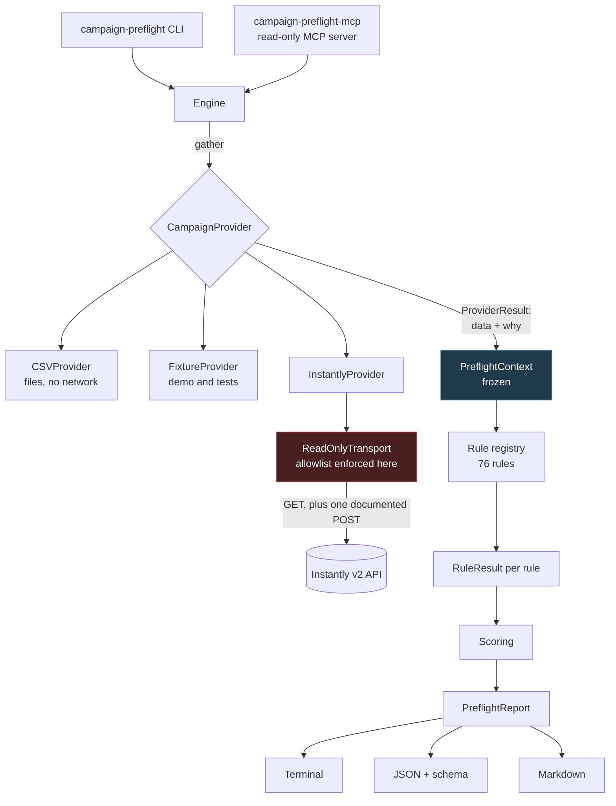

# Architecture

## The shape of a run

Two phases, deliberately separated. **Gather** is the only code that talks to a
provider. **Evaluate** is pure: given a context, it produces the same results
every time.

## The idea the design is built around

A checker that cannot tell "I looked and it was fine" from "I could not look" is
worse than useless — it converts an outage into a green light.

So no provider method returns a bare value. Every one returns a
`ProviderResult`, which carries a `CapabilityStatus`:

| Status | Meaning |
|---|---|
| `SUPPORTED_OK` | Read succeeded. An empty list genuinely means nothing is there. |
| `SUPPORTED_FAILED` | The capability exists; this attempt failed. |
| `UNSUPPORTED` | This provider cannot supply it at all. |
| `UNAVAILABLE_PERMISSIONS` | Credentials are valid but lack the scope or plan. |
| `UNAVAILABLE_CONFIG` | The run was not given what it needed. |

The engine reads a rule's declared `requires` and, if any capability is not
`SUPPORTED_OK`, short-circuits the rule to `UNKNOWN` before it runs. Rules
cannot opt out. That is what makes "missing data never becomes `PASS`" a
structural property rather than a convention — and it is asserted for every rule
against every failure status in `tests/unit/test_registry.py`.

## Modules

| Module | Responsibility |
|---|---|
| `models.py` | Frozen Pydantic v2 domain models. All datetimes are timezone-aware UTC. |
| `normalization.py` | Deterministic text, email, domain, token, and URL handling. |
| `config.py` | Versioned, strictly-validated configuration. |
| `providers/base.py` | The read-only provider contract and `ProviderResult`. |
| `providers/csv_provider.py` | File input. Streams rows; reports bad ones, never drops them. |
| `providers/fixture_provider.py` | Demo and tests. Any capability state, on demand. |
| `providers/instantly_transport.py` | **The write barrier.** |
| `providers/instantly_provider.py` | Instantly v2 reads, retries, pagination, enum mapping. |
| `rules/` | 76 rules, one module per category. |
| `scoring.py` | The published score formula and the readiness decision. |
| `engine.py` | Gather, evaluate, assemble. |
| `reporting/` | Terminal, JSON, Markdown, redaction, CSV export. |
| `mcp/` | The read-only MCP server. |
| `cli.py` | Typer CLI and the documented exit codes. |

## Why the context is frozen

`PreflightContext` and every model it holds are `frozen=True`. "A rule must not
mutate its input" is therefore enforced by the type system rather than by
review. `tests/unit/test_registry.py` additionally serializes the context before
and after every rule and compares — belt and braces, because a rule that quietly
edited shared state would produce findings that depend on rule order.

## Determinism

Identical input produces byte-identical output. Concretely:

- `all_rules()` returns rules sorted by id.
- Affected-record samples are sorted and bounded before they reach a report.
- JSON keys are emitted in a fixed order.
- The clock is injectable (`run_preflight(..., now=...)`), so time-dependent
  rules are reproducible.

This is what makes a committed report a useful artifact: the diff between two
runs means something happened.

---

# Threat model

Campaign Preflight handles two things that matter: a provider API key, and a
list of real people's contact details. It also ingests text scraped from pages
that a target controls.

## Assets

| Asset | Where it lives |
|---|---|
| Provider API key | Process environment only |
| Contact PII | In memory during a run; masked in output |
| Lead research and evidence | Local files the user names |
| Campaign copy | Local files or the provider |

## Threats and controls

### Credential leakage

*A key reaches a log, a report, an exception, a PR comment, or shell history.*

- The key is read from the environment. There is no `--api-key` flag and no MCP
  tool argument accepts one.
- The key is set once as an `Authorization` header and never formatted into a
  message.
- `redact_secrets()` runs over every provider-facing error string, every log
  line, and every rendered report — **unconditionally**. `--no-redact` disables
  PII masking, never secret masking.
- Tested including the poisoned-response case: a provider that echoes your key
  back in an error body cannot get it into a report.

### Malicious CSV content

*A lead file is hostile rather than merely messy.*

- Row and file size bounds; a single field is capped at 1 MB.
- `csv.field_size_limit` is set explicitly so an oversized cell is reported
  rather than aborting the read.
- Control characters, zero-width characters, and bidirectional overrides are
  detected and reported (`contacts.control_characters`) — the last of these can
  make text display differently to a human reviewer than it does to a parser.
- Malformed rows are kept and reported. Dropping them would make a broken list
  look clean.

### Spreadsheet formula injection

*A cell beginning `=`, `+`, `-`, or `@` executes when someone opens an export.*

- Reported in your input by `contacts.formula_injection`.
- **Neutralized in everything this tool writes.** The `--affected-csv` export
  prefixes any formula-like value. Reporting the risk while reintroducing it
  would be indefensible; there is a test.

### Prompt injection in lead research

*Enrichment scrapes a page the target controls; that page contains instructions
aimed at whatever LLM reads it next.*

This is the threat most specific to modern outbound, and it is a
`BLOCKER`-severity rule. `personalization.prompt_injection` matches known
injection shapes in personalization and custom variables. When it fires, that
text was already queued to be emailed out under your domain.

The MCP server is also a mitigation in the other direction: an agent reading a
campaign through it cannot act on anything it finds, because there is nothing to
act with.

### Path traversal and symlink redirection

- Only paths the user explicitly names are opened. No directory is scanned,
  walked, or globbed — including from MCP.
- Paths are resolved and symlinks are refused unless
  `CAMPAIGN_PREFLIGHT_ALLOW_SYMLINKS=1`.
- Report files are opened `O_NOFOLLOW` with mode `0600`, written to a temporary
  file, then renamed — so an interrupted run leaves no half-written report.

### Oversized input / denial of service

- Bounded everywhere: file sizes, row counts, field sizes, page counts, retry
  counts, sender lookups, sample counts.
- Pagination stops on a repeated cursor, so a looping provider cannot spin the
  tool forever.
- Retries are bounded and jittered; `Retry-After` is honoured.
- Row streaming keeps memory flat; 100,000 leads run in ~3s at ~300 MB.

### Provider response poisoning

*The API returns something unexpected, or something crafted.*

- Every response is shape-checked; a wrong shape becomes a failed capability,
  not a crash or a wrong finding.
- Unknown enum values become `unknown:<value>` and any rule reading them returns
  `UNKNOWN`.
- Error bodies are truncated to 300 characters and redacted before display.
- Redirects are not followed.

### Sensitive data in reports and traces

- Redaction is on by default: mailbox local parts masked, domains kept.
- Affected-record samples are bounded.
- Raw provider responses and full evidence documents are never printed.
- `--no-redact` requires an explicit flag and the report announces its own
  unredacted status.

### Confusing an incomplete check with a successful one

Listed here deliberately, because it is the failure mode most likely to cause
real harm. Controls: the capability model, engine-level short-circuiting to
`UNKNOWN`, `INCOMPLETE` as a first-class verdict, exit code `3`, a distinct
confidence level, an explicit note in MCP output, and a dedicated rule
(`suppression.capability_unavailable`) that reports the *absence* of suppression
data as a finding in its own right.

## Out of scope

- Multi-tenant isolation — this is a local CLI, not a service.
- Provider-side authorization — scopes are Instantly's to enforce; we report
  what we could not read.
- Supply-chain integrity of dependencies beyond a locked `uv.lock`, Dependabot,
  and a dependency audit in CI.

## Reporting a vulnerability

See [SECURITY.md](../SECURITY.md).

---

# Performance

Measured on an Apple Silicon laptop, single run, CSV provider:

| Workload | Time | Notes |
|---|---|---|
| Demo (20 leads) | 0.02 s | Target: under 2 s |
| 1,000 leads | 0.04 s | |
| 10,000 leads | 0.28 s | Target: under 10 s |
| 100,000 leads | 3.0 s | ~300 MB peak RSS |

Verified by `tests/integration/test_performance.py`, which also asserts that
scaling stays roughly linear and that row streaming holds memory flat over
50,000 rows. CI thresholds are looser than these numbers because a shared runner
is slower and noisier; they exist to catch an accidental quadratic, not to
benchmark.

Network behaviour: pagination is sequential, sender lookups run at a concurrency
of 3, retries are capped at 3 with a 30-second ceiling per sleep.
